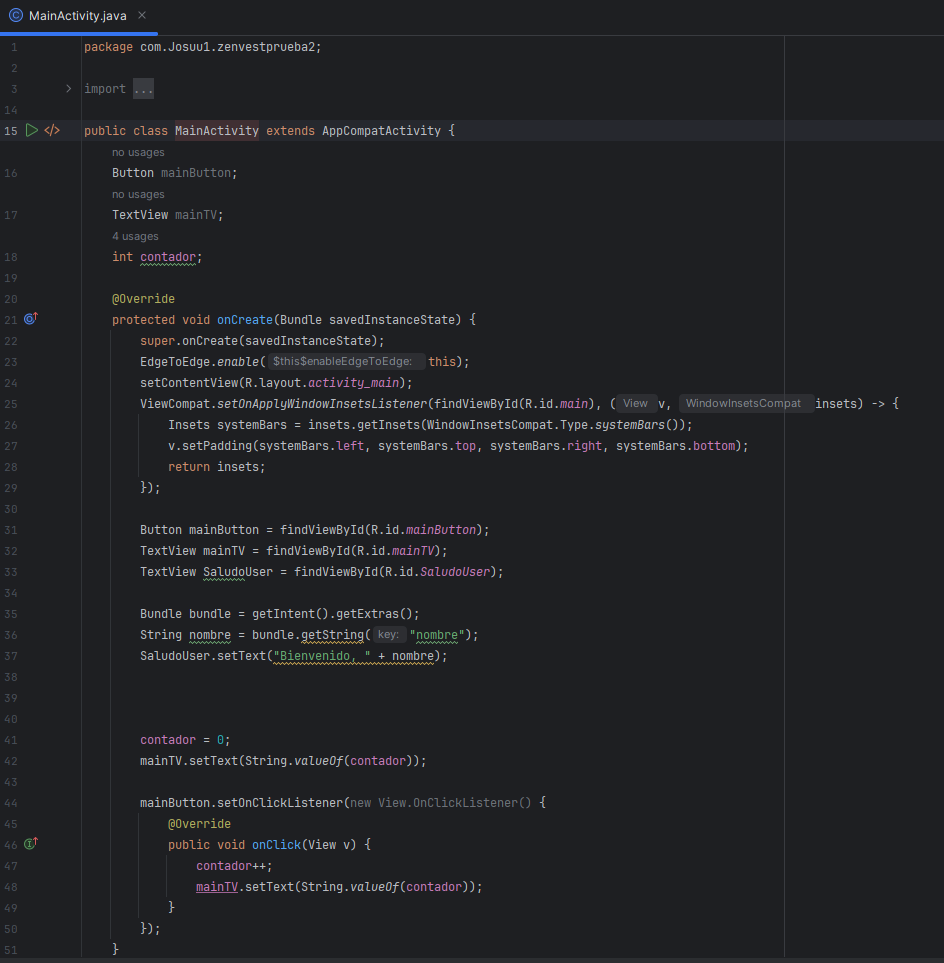
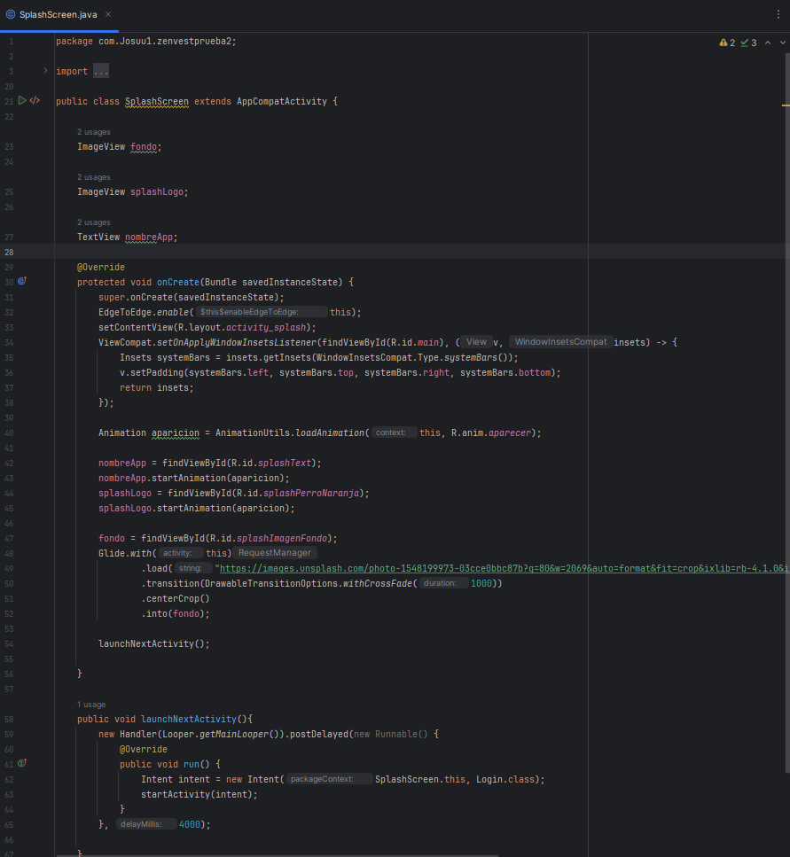
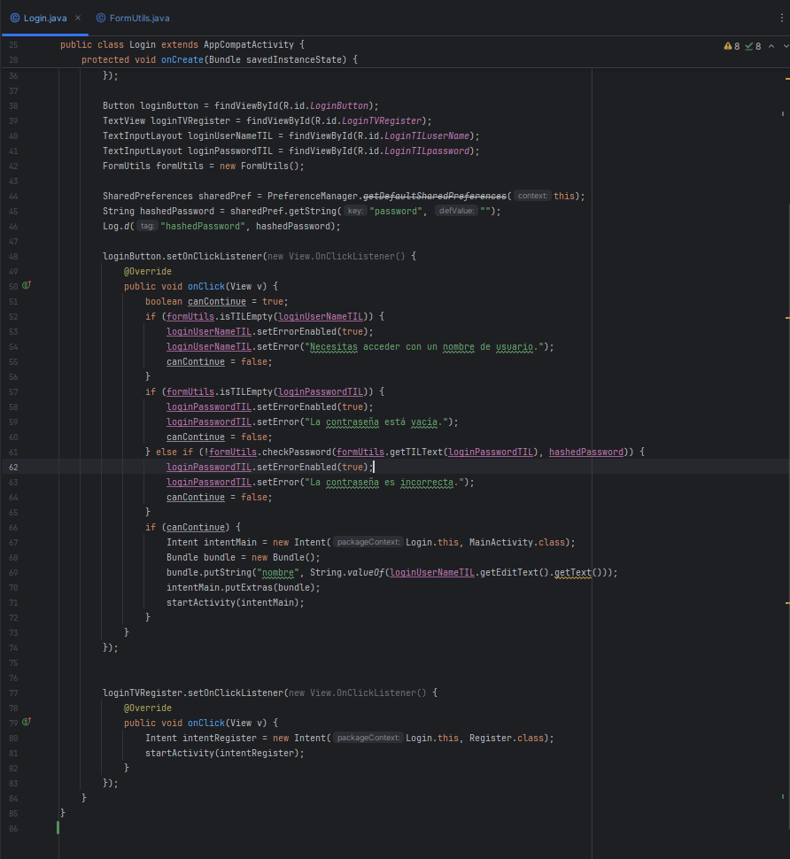
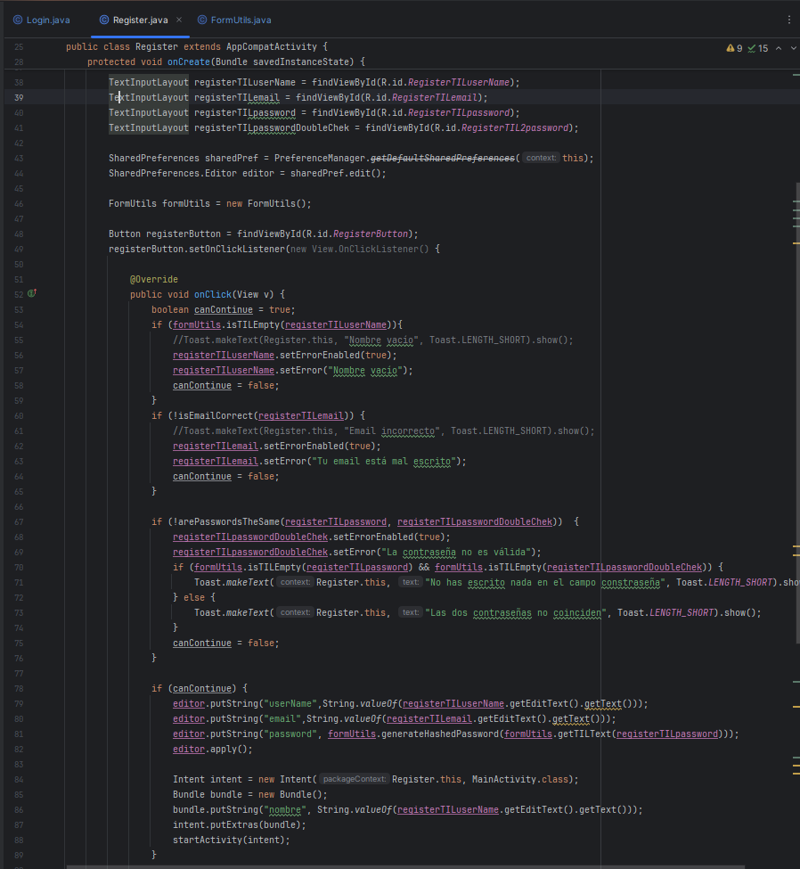
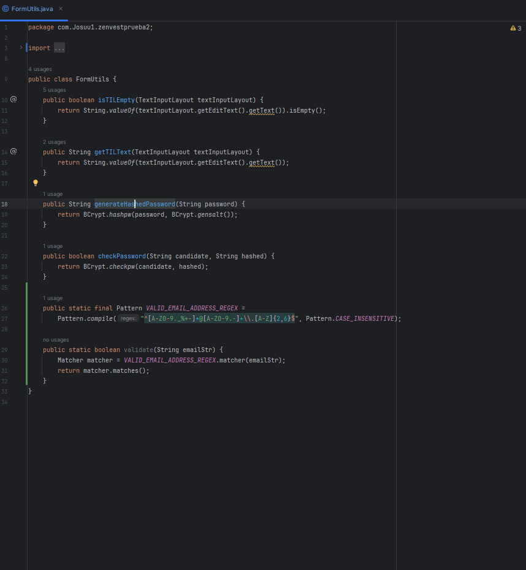
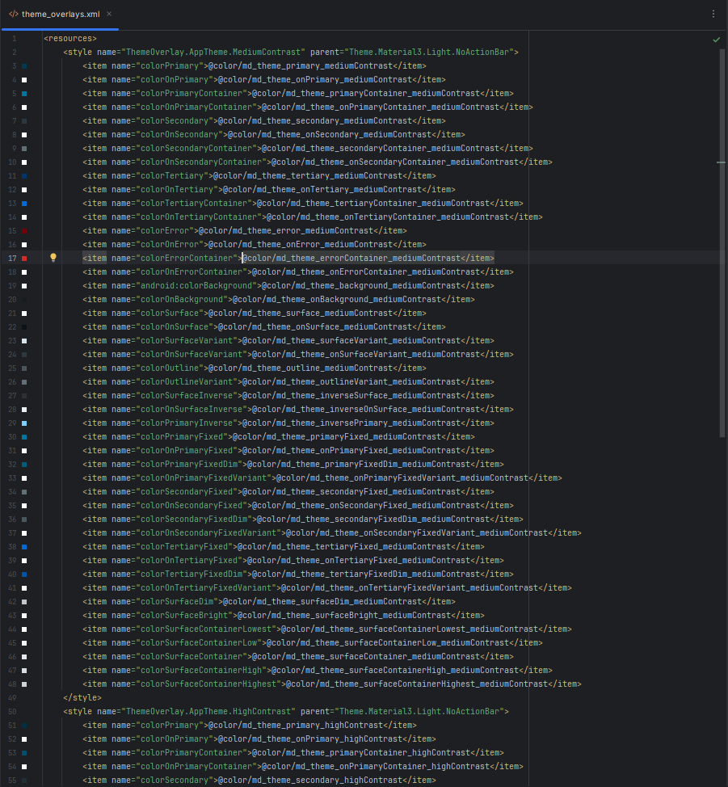

- El main activity es la pagina principal de la app.

- Con esto nos encargamos de buscar los elemetnos del layout que pusimos en el archivo xml, para poder editarlos y trabajar con ellos en el codigo.
  Button mainButton = findViewById(R.id.mainButton);
  TextView mainTV = findViewById(R.id.mainTV);
  TextView SaludoUser = findViewById(R.id.SaludoUser)

- Con el la clase Bundle recuperamos el valor enviado desde otra actividad como la de login o la de register. 
  Bundle bundle = getIntent().getExtras();
  String nombre = bundle.getString("nombre");
  SaludoUser.setText("Bienvenido, " + nombre);

- Nos muestra una animacion de inicio con una imagen de fondo y una transición de animación, luego redirige al usuario a la pantalla de inicio de sesión

- Con la librería Glide descargamos una imagen y la mostramos en el fondo de la pantalla,
  Glide.with(this)
  .load("").transition(DrawableTransitionOptions.withCrossFade(1000)).centerCrop().into(fondo);

- Y por ultimo hacemos un cambio de pantalla con un temporizador de 4sg
  public void launchNextActivity(){
  new Handler(Looper.getMainLooper()).postDelayed(new Runnable() {
  @Override
  public void run() {
  Intent intent = new Intent(SplashScreen.this, Login.class);
  startActivity(intent);
  }
  }, 4000);

- Es la pantalla de inicio de la app. Aqui se validan los datos guardados que el usuario escribe. Si todo es correcto abre la pantalla del mani activity.
- Recuoera la contraseña hasehada mediante sharedPreference que el usuario registro antes y compara con la que has escrito.
- Tiene validaciones de errores por si no añades correctamente la infomrción en los campos.
- El bundle se encarga de enviar datos a otra actividad.
- Si el usuaio toca el texto "¿No tienes cuenta?", abre la pantalla de Reguister. 

- Es la pantalla de registro de nuestra app.
- Nos permite crearnos una cuenta introduciendo nombre, email y contraseña.
- Se encarga de validar si todos los datos están correctos, si es así guarda la información.
- Con el SharedPreference guardaremos los datos del usuario de forma local en el dispositivo,
- Con el Bundle pasaraemos los datos guardaos a otra pantalla.
- Con los editor.put y editor.apply guardaremos el nombre, email y contraseña hasheada.

- Es una clase de utilidades que podremos reutulizar en nuestro codigo, precisamente para los formularios.
- Hace que nuestro codgio se vea mas limpio y legible

- Los temas los hemos añadido mediante una descarga de archivo realizado en "Material Theme Builder" donde hemos agregado una imagen para que lea la paleta de colores carcateristica.
- En este caso usamos una conbinacion de azules y tono grises para dar un toque elgante y a su vez moderno y profesional.

